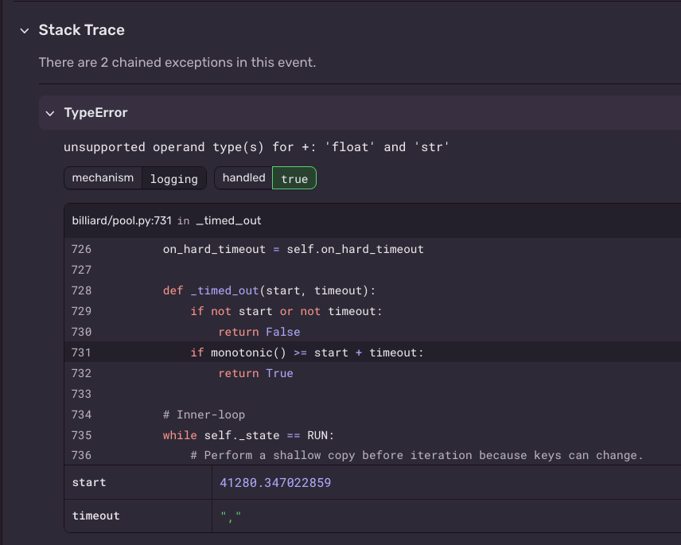

+++
date = '2026-09-04T15:25:56+01:00'
draft = false
title = 'How encoding mismatches silently corrupted our Celery tasks'
tags = ['RabbitMQ', 'Celery', 'Python', 'DevOps', 'Message Queues', "Encoding"]
categories = ['Backend', 'Infrastructure']
+++

During our [RabbitMQ v4.x migration preparation](), we started seeing exceptions
we couldn't make sense of, which lead to a disruption of our services.
<!--more-->

One of the steps I mentioned in our [RabbitMQ v4.x migration]() was to
[transfer messages between queues in different vhosts](), and
that meant that we had to read from `queue1` in `vhost1` and "copy" that message to `queue2` in `vhost2`.

We did this progressively for each environment, and it went smoothly for the first N ones until one day, we started seeing
the following exception in Sentry:
```text
TypeError: unsupported operand type(s) for +: 'float' and 'str'
```

Upon inspecting the details in Sentry, the line throwing that error was in one of the core libraries of Celery: `Billiard`, and
exactly in this line where it was trying to execute the following [line](https://github.com/celery/billiard/blob/bd2f803b78f9f2a7fce62ed6d846333270f29e07/billiard/pool.py#L731):

```python
if monotonic() >= start + timeout:
    ...
```

The `Sentry` stack trace was showing us that `start` was a valid float, but timeout however had a value of `,`: a mystery we couldn't make sense of in the beginning.

<details>
<summary>Sentry Snippet</summary>



</details>

So this raised the question: What was happening, and why ?

The answer lives in how RabbitMQ serializes data on the wire — specifically, how it encodes values in message headers.
To understand it, we need to look at three things: how AMQP structures data into frames, what message headers actually are, and how values inside those headers get encoded as bytes.

This is going to be technical, so strap in.

## AMQP frames

RabbitMQ uses the `AMQP` protocol under the hood for publishing messages, consuming, etc.

The protocol relies on TCP for consistent byte streaming, but wraps/organizes data in a structure called [frames](https://www.brianstorti.com/speaking-rabbit-amqps-frame-structure/), and each frame
basically has a type, and a predefined structure that conveys which kind of information it carries.

A frame is the unit of data AMQP sends over TCP — a fixed envelope with a type, channel number, and payload.

The [official protocol specification](https://www.rabbitmq.com/resources/specs/amqp0-9-1.pdf) is quite nice and will contain
all the details to build a more precise understanding of frames.

Brian's article about [AMQP's frame structure](https://www.brianstorti.com/speaking-rabbit-amqps-frame-structure/) is also a nice
and brief read if you don't want to read an entire technical spec.

## The `headers` property

When you publish a message, one of the frames it sends contains what's called "properties" in AMQP lingo, which are metadata about the message, such as the `content-type`, `content-encoding`, etc.

Just like the `content-type` property, there is also a `headers` property which is basically a hashmap-like data structure, but it's called a `Field Table` in AMQP terms.

So in short: A `Field Table` is a binary encoding of a dictionary.

## Field table encoding

Understanding how the encoding works is the most critical part in this entire article, so take your time to read and understand
this in order to make sense of what was going on.

Each entry in the field table is defined by 4 things:
* The key name length: Encoded over 1 byte.
* The value of the key name: Encoded over N bytes, where N corresponds to the length derived from the previous entry
* The type tag: The type of the value corresponding to the key being read, encoded over 1 byte
* The value of the key: Encoded over M bytes, where M is determined based on the type tag itself

AMQP defines a set of named integer types, each mapped to a specific byte width — the type tag tells the reader how many bytes to consume for the value.

Section 4.2.1 of the [Spec](https://www.rabbitmq.com/resources/specs/amqp0-9-1.pdf) lays out all the type tags and their sizes.

<details>
<summary>Field table entry Example</summary>
The best way to make sense out of this is via an example.

Let's suppose we want to send the following headers dict `{"amount": 300}`

The entry would look something like this

```text
06 61 6D 6F 75 6E 74 55 01 2C
```

Let's go over how this gets interpreted, step-by-step:

First, it reads `06`, which tells it that the key of this entry has a length of `6` bytes.

This leads it to reading 6 bytes to determine the value of that key, those 6 bytes being: `61 6D 6F 75 6E 74`.

These are the hexadecimal ASCII characters that decode to `amount`.

Next, it reads the `type tag` to determine the value that comes with the `amount` key.

Type tags are always 1 byte. Here, that byte is `55`.

`55` in hexadecimal corresponds to the ASCII character `U`, which means the value is a `Short Int`.

Short-ints are always encoded over 2 bytes, so AMQP knows that the next 2 bytes will be an encoding of the integer value
which means `01 2C` are the bytes to read, which evaluate to 300.

300 doesn't fit in a `Short Short Int` (1 byte with a max value of 255), so the next type up is a `Short Int`, which uses 2 bytes.
</details>


## The discrepancy in codec

In order to transfer messages, we used [Aio Pika](https://docs.aio-pika.com/) to read from the queues, make some
modifications to the headers, and send it off.

Now, `aiopika` used [pamqp](https://github.com/gmr/pamqp) under the hood for encoding, and `amqp` uses `s` as the type tag
for 16bit integers.

However, `Celery` uses `Kombu` at the transport layer, which in turn uses [py-amqp](https://github.com/celery/py-amqp) for encoding/decoding.

The catch is, `py-amqp` interprets the `s` type tag as short string, and that's exactly what messes things up and here's how:

Suppose we want to send the following headers over the wire `{"some-key": 300}`, so by the time we'd want to encode the `300` value,
the following happens:

- `pamqp` sends the following `73 01 2C` byte sequence over the wire, meaning:
* The type tag is `s`, a 16bit integer, which in hex is `73`
* Since it's 16 bit, the `300` value is encoded over 2 bytes: `01 2C`

- `py-amqp` now kicks in and receives the `73 01 2C` byte sequence, meaning: 
* The type tag is `s`, which means it's a short string
* Because it's a short string, the first byte means the length of the string which in this case it's `01` = It's a one character string
* Since it's a one character string, it the value is simply the next byte `2C` is the actual string, and `2C` converts to the `,` character

Our case was quite similar, because the headers contained a `timeout` key, whose value was a tuple of 2 16bit integers, who just
so happen to have `300` as one of the values, which `Celery` `py-amqp` decodes as `,`, and passes it to that `_timed_out` function
we mentioned at the start, leading to the infamous exception we were running into.

## How we solved this

The fix forward was simply to use `pika` for transferring the messages instead of `aio-pika`, which would ensure the encoding/decoding
would be consistent.

As for messages that were corrupt, we did the following:
* Send a `delivery-limit` in RabbitMQ
* When messages hit that delivery limit, drive those messages to a dead-letter-queue
* Wrote a script that would read from those DLQs, check the `timeout` header, and fix the value from `[None, ] to `[None 300]`
* Redrive those messages back to the original destination queue